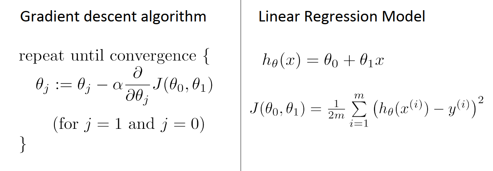

# Linear Regression

## What is Linear Regression?
Regression is predicting a continuous or real output given some inputs.  
Linear regression is mapping the relationship between the inputs and a continuous output with a straight line.    
The mapping function is known as the hypothesis.  

### **Hypothesis**  

 

For linear regression, the hypoothesis function is the equation of a straight line.  

In the hypothesis above, there is only one input variable x.  
The parameters or weights theta, are a measure of how strongly the the inputs influence the output.  
Theta 0 is the bias term.  
These parameters are learned by the linear regression algorithm as it is being trained thorough gradient descent.

### __Gradient descent__
To understand gradient descent, we must first understand the cost function.  
Say you start with random values of theta and predict the output usinf the hypothesis function. The error between the hypothesis and the actual output is the cost or loss. A variety of loss functions are available. If we choose mean squared error as our loss function, the cost function, J becomes:  

  

Gradient descent tries to minimize the cost function.  
  

  

 

THe cases above are ideal and the gradient descent algorithm doesnt get stuck in a local minima ( the cost function curve is smooth or convex).  

The algorithm can get stuck in local minima as shown below.  

  

  

#### Gradient Descent algorithm

  

To minimize the cost function gradient descent updates the parameters theta until the cost is at a minimum.

  

*__steps__*  
* Begin with random parameters
* Make a hypothesis
* Find the mean squared error between the hypothesis and the actual output.
* Divide by 2 to get the cost. This is done because minimizing the cost for half the training samples will accomplish the same as doing it for all.  
* Find the partial derivative of  the cost with respect to each of the parameters.  
  
* Multiply the derivative by the learning rate, alpha. The learning rate determines how much the parameters will change with every iteration of gradient descent.  
* Simultaneously update all the parameters.  

    

* Repeat until cost is at a minimum.  
    

  Notice that when j is 0 ,ie theta is the bias, the partial derivative yields a constant 1, since theta_0 is not a coefficient of an input.  

This method of gradient descent is known as batch gradient descent. Each step of gradient descent uses all the training examples.  

## Linear Regression with one variable  
__Problem Statement__  
Suppose you are the CEO of a restaurant franchise and are considering different cities to open a new outlet.  
The chain already has trucks in various cities and you have data for profits and populations from the cities.  
Implement linear regression to predict profits of a food truck.  

*[This file](ex1.m) steps through the exercise. The main steps of the exercise are discussed below.*  

__Data__  
Part 2 in [this](ex1.m).  
[This Dataset](ex1data1.txt) has 97 training samples, one row for each sample. Every row has two values. The first is the population x, and the second, the profit y.  
Onwards we shall refer to the first column of the dataset as X, and the second as y

[Plot Data](plotData.m) generates the following figure.  

  

From this plot, we can observe that when the population of a city increases, so do the profits of food trucks.  

__Cost and Gradient Descent__  
Part 3 in [this](ex1.m).  
* Add a column of ones to X. This is the column of bias terms whose coefficient will be theta_0.  
* Initialize the parameters theta to zero.  
* Gradient Descent settings:  
  * Iterations : 1500
  * Learning rate : 0.01
* Run gradient descent by calling [gradient descent function](gradientDescent.m) with the iterations, learning rate, X and y.  
This function makes calls to [compute cost ](computeCost.m) to calculate the cost after every iteration of gradient descent.  
Thetas with the lowest cost are returned as the learned parameters.

* Plot the linear fit.

  

__Visualizing Gradient Descent__  
Part 4 in [this](ex1.m).  
*Surface Plot*  
  

*Contour Plot*  

The red x marks the learned values of theta. This spot coincides with the purple regions of the surface plot with the lowest value of cost.  

(theta_0, theta_1) = (-3.630291, 1.166362)  
*__linear hypothesis = -3.630291 + 1.166362 * x__*

